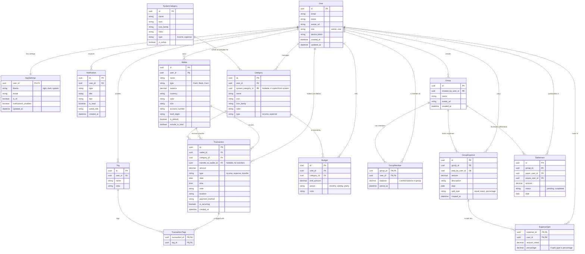

# HisaabBee Entity Relationship Diagram (ERD)

This document outlines the normalized database schema for the HisaabBee application.

## Legend

- **PK**: Primary Key
- **FK**: Foreign Key
- **1..1**: One-to-One
- **1..N**: One-to-Many
- **N..N**: Many-to-Many

## Module Details

### 1. Authentication & User Profile

- **User**: Core entity. Stores authentication credentials (hashed), profile info, and role (admin or user).
- **AppSettings**: 1:1 relationship with User. Stores device-specific or account-wide preferences like theme and language.
- **Notification**: History of alerts sent to the user.

### 2. Personal Finance Management

- **Wallet**: Represents a source of funds (Bank Account, Cash, Credit Card). 'include_in_total' flag determines if it counts towards net worth.
- **SystemCategory**: Immutable master list of default categories provided by the platform.
- **Category**: User-specific category list. Users can create custom categories or copy from `SystemCategory`. Once copied, they can modify the name/color/icon independently.
- **Tag**: orthogonal classification for transactions (e.g., #trip, #urgent).
- **Transaction**: The central event entity. Links Wallet and Category.
  - Includes `transfer_to_wallet_id` to handle internal transfers (double-entry bookkeeping logic simplified).
- **TransactionTags**: Many-to-Many link between Transactions and Tags.
- **Budget**: Set limits per Category for a specific period.

### 3. Social Finance (Split Bill)

- **Group**: A collection of users sharing expenses.
- **GroupMember**: Linking table for Users in Groups. Caches the 'balance' (net owe/owed) for performance.
- **GroupExpense**: A bill paid by one member on behalf of the group.
- **ExpenseSplit**: Detail of how a GroupExpense is divided among members.
- **Settlement**: A payment transaction between members to settle debts within a group context.

## Normalization Notes

- **Category**: Separated from Transaction. `SystemCategory` acts as a catalog. User `Category` table acts as the mutable list for user's transactions.
- **Tags**: Many-to-Many relationship allows for flexible tagging without duplicating data.
- **Splits**: `ExpenseSplit` is a separate table rather than a JSON array (unlike the current frontend store) to query "how much does User X owe in total" efficiently using SQL aggregates.
- **Users**: In the frontend `Friend` model, friends might be ad-hoc. In this normalized schema, we assume they are mapped to `Users`. If "Shadow Users" (non-registered friends) are needed, a `is_registered` flag on the User table or a separate `GuestUser` table linked to the creator would be added.
